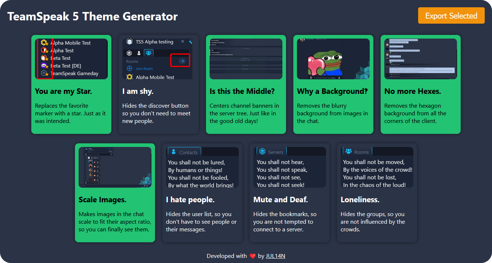

<div align="center">
  <h1>TeamSpeak 5 Theme Generator</h1>
  
</div>

## Usage

* Go to [https://gamer92000.github.io/teamspeak-5-theme-generator/](https://gamer92000.github.io/teamspeak-5-theme-generator/)
* Pick your desired theme components
* Click on `Export Selected`
* Install the theme as any other theme

## Contributing

If you want to contribute to this project, feel free to open a pull request.  
All theme components are located in the `public/components.json` file.  
To start the local development server, you need `node.js` and `pnpm`.
```bash
pnpm install
pnpm start
```

## About

This project was inspired by [Vanilla Tweaks](https://vanillatweaks.net/).